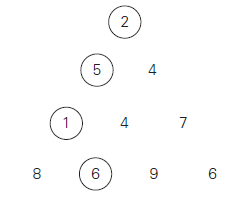

## Minimum-sum descent

 
Some positive integers are arranged in an equilateral triangle with n numbers in its base like the one shown in the figure below for n = 4. The problem is to find the smallest sum in a descent from the triangle apex to its base through a sequence of adjacent numbers (shown in the figure by the circles). Design a dynamic programming algorithm for this problem and indicate its time efficiency.

 

